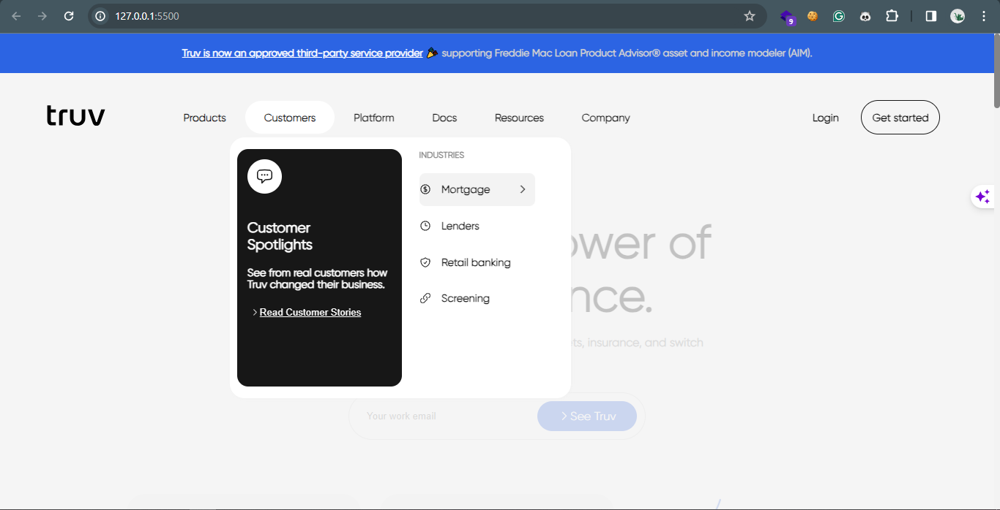

# Replica of Truv (project)

This shows a good command of the following languages:

- HTML
- CSS
- Vanilla JS

It consequently emphasizes important web development skills such as:

- Creating a well-structured project structure with well-documented code: Separation of concerns between HTML, CSS, and JavaScript files, following best practices and conventions.
- Applying intricate and responsive styles
- **Responsive design**
- Accessibility: by incorporating proper HTML semantics, ARIA roles, and providing alternative text for images and other media.
- Javascript interactivity
- Version control: good knowlegde of git workflow
